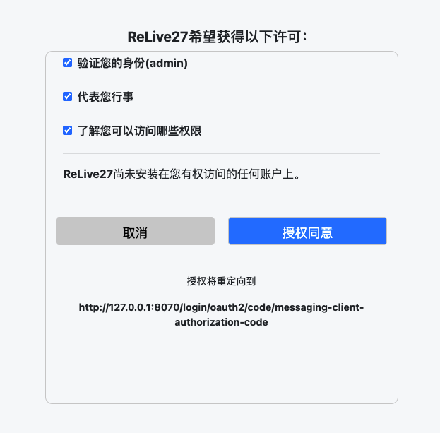

## Relevant Information:

In this module we use Spring Authorization Server to create an OAuth2.0 authorization server, When we test
access [http://localhost:8080/oauth2/authorize?response_type=code&client_id=relive-client&scope=message.write%20message.read%20profile&state=some-state&redirect_uri=http://127.0.0.1:8070/login/oauth2/code/messaging-client-authorization-code](http://localhost:8080/oauth2/authorize?response_type=code&client_id=relive-client&scope=message.write%20message.read%20profile&state=some-state&redirect_uri=http://127.0.0.1:8070/login/oauth2/code/messaging-client-authorization-code)
in the browser. After entering the username and password(admin/password) to pass the authentication, we will see the
following custom authorization page:  

## Relevant Articles:

- [Custom OAuth2 Authorization Consent Page](https://relive27.github.io/blog/custom-oauth2-consent-page)
